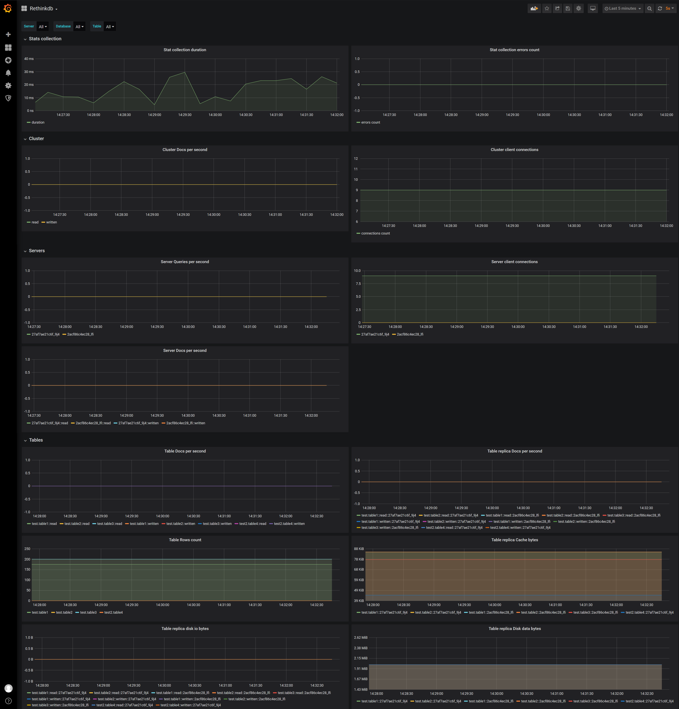

# RethinkDB Prometheus exporter

[](https://github.com/rethinkdb/prometheus-exporter/releases)
[](https://godoc.org/github.com/rethinkdb/prometheus-exporter)
[](https://travis-ci.org/rethinkdb/prometheus-exporter)

[RethinkDB](http://www.rethinkdb.com/) statistics exporter for [Prometheus](https://prometheus.io/).

Current version: v1.0.1 (RethinkDB v2.4)

## Build and Run
Local build and run:
```shell script
git clone https://github.com/rethinkdb/prometheus-exporter.git
cd prometheus-exporter
go build -o rethinkdb-exporter
./rethinkdb-exporter
```

Docker build and run:
```shell script
git clone https://github.com/rethinkdb/prometheus-exporter.git
cd prometheus-exporter
docker build --tag rethinkdb-exporter .
docker run -d -p 9050:9050 rethinkdb-exporter 
```

## Parameters
Exporter can get parameters from config file, CLI flags or Environment variables.

| CLI flag | Env var name | Config key | Description |
| --- | --- | --- | --- |
| --config | - | - | Config file (default to prometheus-exporter.yaml) |
| --web.listen-address string | WEB_LISTEN_ADDRESS | web.listen_address | Address to listen on for web interface and telemetry (default "0.0.0.0:9055") |
| --web.telemetry-path string | WEB_TELEMETRY_PATH | web.telemetry_path | Path under which to expose metrics (default "/metrics") |
| --db.address | DB_ADDRESSES | db.rethinkdb_addresses | Address of one or more nodes of rethinkdb (default [localhost:28015]) |
| --db.enable-tls | DB_ENABLE_TLS | db.enable_tls | Enable to use tls connection |
| --db.ca | DB_CA | db.ca_file | Path to CA certificate file for tls connection |
| --db.cert | DB_CERT | db.certificate_file | Path to certificate file for tls connection |
| --db.key | DB_KEY | db.key_file | Path to key file for tls connection | 
| --db.username | DB_USERNAME | db.username | Username of rethinkdb user |
| --db.password | DB_PASSWORD | db.password | Password of rethinkdb user |
| --db.pool-size | DB_POOL_SIZE | db.connection_pool_size | Size of connection pool to rethinkdb (default 5) |
| --log.debug | LOG_DEBUG | log.debug | Verbose debug logs |
| --log.json-output | LOG_JSON_OUTPUT | log.json_output | Use JSON output for logs |
| --stats.table-estimates | STATS_TABLE_ESTIMATES | stats.table_docs_estimates | Collect docs count estimates for each table |

Config file can be yaml or json. Example:
```yaml
web:
    listen_address: "0.0.0.0:9050"
db:
    rethinkdb_addresses:
      - "0.0.0.0:28015"
      - "0.0.0.0:28016"
stats:
    table_docs_estimates: true
```

## Metrics
Most of the [RethinkDB stats table](http://rethinkdb.com/docs/system-stats/) are exported. 

Optionally table rows count estimates can be exported from [Table info](https://rethinkdb.com/api/javascript/info).

## Grafana dashboard
[Grafana](https://grafana.com/) can be found [here](grafana-dashboard.json).



## Contribution
Pull requests and issues are welcome.
